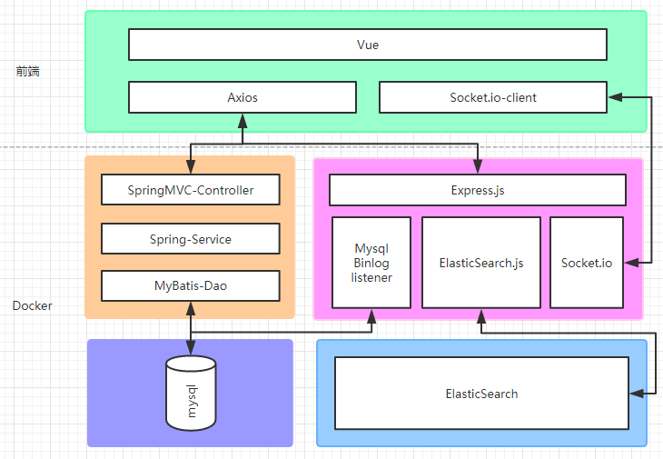

# E.M.S消息推送与搜索服务

(服务于[ZUCC问答论坛](https://github.com/lychs1998/QA-bbs-front)，==不适用于其它项目，但可供参考==)

[]()

## ZUCC问答论坛项目简介

核心功能为课堂问答，学生和老师可以在此提问与回答。

前端实现全局响应式，遵循Material Design设计规范，页面分为：首页、搜索、个人主页、问题详情页、收藏页、版本信息。

## EMS-Message-push项目简介

使用ElasticSearch+Mysql Binlog+Socket.io构建的消息推送与搜索服务。

使用Mysql做持久化处理，利用Mysql binlog将数据同步到ElasticSearch，ElatsicSearch提供搜索功能。在监听到回答表insert事件时，判断用户socket.io是否保持连接，如果连接向前端推送未读消息，反之，则存储进es中，等待用户上线时推送。

## 项目结构图



## 功能特性

- ES与Mysql数据同步
- Socket.io实时推送
- Express+ElasticSearch提供搜索接口

## 开发环境依赖

- Node.js

## 项目部署

安装Node.js后使用npm安装Forever

```bash
npm install forever -g

//如果官方源速度过慢，建议更换npm源为国内淘宝源
npm config set registry https://registry.npm.taobao.org
```

运行项目

```bash
git clone https://github.com/lychs1998/EMS-Message-push.git
cd EMS-Message-push
npm install

//修改index.js中的数据库连接账号，且修改Mysql配置文件，打开binlog
//运行
forever start index.js
```

==注意==Mysql8.0以上变更了密码的加密方式，会报错，可参考下面的SQL语句修改加密方式。

```mysql
 -- 记得将下面的root和password修改为你想要修改的用户名与密码
 ALTER USER 'root'@'localhost' IDENTIFIED BY 'password' PASSWORD EXPIRE NEVER;
 ALTER USER 'root'@'localhost' IDENTIFIED WITH MYSQL_NATIVE_PASSWROD BY 'password' ;
```

## 实现说明

实现==Http请求跨域访问==，关键代码如下：

```javascript
app.all('*',function (req, res, next) {
  res.header('Access-Control-Allow-Origin', '*');
  res.header('Access-Control-Allow-Headers', 'Content-Type, Content-Length, Authorization, Accept, X-Requested-With , yourHeaderFeild');
  res.header('Access-Control-Allow-Methods', 'PUT, POST, GET, DELETE, OPTIONS');
  if (req.method == 'OPTIONS') {
    res.sendStatus(200); 
  }
  else {
    next();
  }
});
```

实现==在Mysql被其它后端程序占用时监听它的变化，并且不影响原程序以及Mysql的读写==，关键代码与步骤如下：

```javascript
var ZongJi=require('@rodrigogs/zongji');
//连接数据库
var zongji = new ZongJi({
    host     : 'localhost',
    user     : 'root',
    password : 'xxx'
});

//监听到binlog变化后执行
zongji.on('binlog', function(evt) {
    var event=evt.getEventName();
    var table=String(evt.tableMap[evt.tableId].tableName).toLowerCase();
    var rows=evt.rows;
    if (event==='writerows') {
        if (table==='question') {
            //do
        } else if (table==='answer') {
            //do
        }
    } else if (event==='deleterows') {
        if (table==='question') {
            //do
        } else if (table==='answer') {
            //do
        }
    }
});
//开始监听，并设置监听的数据库、表与事件
zongji.start({
    serverId:1,
    startAtEnd:true,
    includeEvents: ['tablemap','writerows','deleterows'],
    //j2ee为数据库名，answer question为表名，another_db:false表示不监听其它表
    includeSchema:{'j2ee':['answer','question'],'another_db':false}
});

//程序退出时关闭监听
process.on('SIGINT', function() {
    console.log('Got SIGINT.');
    zongji.stop();
    process.exit();
});
```

实现==将监听到的Mysql的增删改查数据推送至ES，并建立索引==，关键代码与步骤如下：

```javascript
//ES搜索
async function esSearchAnswers(keyword) {
  return await client.search({
    index:'answers',
    type:'answer',
    body:{
      query:{
        match:{
          text:keyword
        }
      }
    }
  })
}
//ES删除
async function esDeleteReplyMQ(answerID) {
  await client.delete({
    index:'reply_mq',
    id:answerID,
  }).catch(function(err){
    console.log(err);
  });
}
//ES单项搜索
async function esSearchUserID(data){
  const {body}= await client.get({
    index:'questions',
    type:'question',
    id:data.questionID,
  }).catch(function(err){
    console.log(err);
  });
  return body._source.userID;
}
//ES索引建立与插入数据
async function esPushQuestions(data) {
  const reg = /[\\\`\*\_\[\]\#\+\-\!\>]/g;
  const text=data.detail.replace(reg, "");
  await client.index({
    index:'questions',
    type:'question',
    id:data.questionID,
    body:{
      questionID:data.questionID,
      question:data.question,
      text:text,
      tags:data.tags,
      detail:data.detail,
      userID:data.userID,
      star:data.star,
      createTime:data.createTime
    }
  }).catch(function(err){
    console.log(err);
  });
}
//ES更新数据
async function esUpdateQuestions(data) {
  const reg = /[\\\`\*\_\[\]\#\+\-\!\>]/g;
  const text=data.detail.replace(reg, "");
  await client.update({
    index:'questions',
    type:'question',
    id:data.questionID,
    body:{
      questionID:data.questionID,
      question:data.question,
      text:text,
      tags:data.tags,
      detail:data.detail,
      userID:data.userID,
      star:data.star,
      createTime:data.createTime
    }
  }).catch(function(err){
    console.log(err);
  });
}
```

实现==用户token鉴权==，关键代码与步骤如下：

```javascript
//JWT使用token的加密算法解密token获得UserID
var jwt=require('jsonwebtoken');
function getUserId(token){
    //xxx为私钥
    return String(jwt.verify(token,'xxxxx',{algorithms:['HS256']}).userID);
}
```

实现==用户的上线与下线监听以及消息实时推送==，关键代码与步骤如下：

```javascript
/*服务端*/
var message_push=io.of('/socket.io');
//存储在线用户的socket
var usocket = {};

//如果用户在线，则通过socket推送，如果不在线则插入到ES中
function esPushToMQ(data){
  esSearchUserID(data[0]).then(
    uid=>{
      if(uid in usocket){
        usocket[uid].emit("reply",data);
        console.log('reply');
        console.log(data);
      }else{
        console.log('push-');
        console.log(data);
        esPushReplyMQ(data[0]);
      }
    }
  )
}

async function esSearchReplyMQ(userID,socket) {
  await client.search({
    index:'reply_mq',
    type:userID,
  }).then(results=>{
    if(results.body.hits.hits.length>0){
      var messages=[]
      results.body.hits.hits.forEach(e => {
        messages.push(e._source);
        esDeleteReplyMQ(e._id);
      });
      socket.emit('reply',messages);
    }
  }).catch(function(err){
    console.log(err);
  });
}

message_push.on('connection',function(socket) {
    socket.on('login',function(msg) {
        var userID=getUserId(msg);
        if(!(userID in usocket)){
          console.log(userID+' 已连接');
          socket.username = userID;
          usocket[userID] = socket;
          esSearchReplyMQ(userID,socket);
        }
    });
    socket.on('disconnect', function(reson){
      if(socket.username in usocket){
        delete(usocket[socket.username]);
        console.log(reson);
      }
    });
});

/*客户端*/
//main.js初始化
import SocketIO from 'socket.io-client'
var socket=SocketIO('http://localhost:2333/socket.io');
Vue.prototype.$socket = socket;

//App.vue
//移除所有监听事件，避免重复监听
this.$socket.removeAllListeners()
//传递token建立连接
this.$socket.emit('login',String(this.$cookie.get('token')));
//收到消息时弹窗提醒
this.$socket.on('reply',function(msg) {
    console.log(msg);
    if(msg.length>0){
        msg.forEach(data => {
            this.newSnotify(data);
        });
    }
}.bind(this))
```

## 主项目历史版本

##### v0.1.3 Beta版本

- 增加搜索功能
- 修复与优化滚动加载判定
- 自己的问题有新的回答会有实时推送

##### v0.1.2 Beta版本

- 添加用户主页，可点击用户头像进入他人主页
- 后端重构，修复重复创建连接池的错误
- 首页可以按收藏数进行排序了
- 修复时间显示异常的问题
- 优化修改密码和登录的交互体验
- 侧边栏添加开发经验分享和BUG反馈快捷入口
- 修复了问题详情与问题详情间无法转跳的问题

##### v0.1.1 Beta版本

- 重构前端界面，实现全局响应式，遵循Material Design设计规范
- 添加收藏、点赞与访问统计功能
- 添加版本说明页面
- 添加返回按钮与面包屑导航
- 添加编辑器图片上传功能
- 优化Markdown编辑器在手机端的使用
- 部署至校内服务器测试

##### v0.1.0 Beta版本

- 实现首页问题列表动态加载
- 实现登录/注销功能
- 实现Markdown编辑与渲染
- 实现提问与回答功能
- 实现问题详情页的渲染
- 实现token鉴权、存储与过期
- 实现修改密码功能